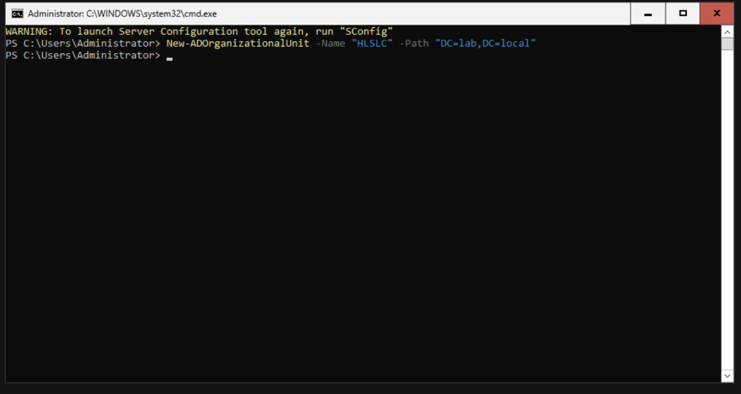

# HomeLab Simulated Logistic Company (HLSLC) — Personnel Roster v1

---

## Creating Organizational Units

Using Powershell:

```
New-ADOrganizationalUnit -Name "HLSLC" -Path "DC=lab,DC=local"
```



HLSLC is deployed in the root of lab.local, inside this OU (Organizational Unit) the different departments of the company will be nested.

```
New-ADOrganizationalUnit -Name "Accounting" -Path "OU=HLSLC,DC=lab,DC=local"
New-ADOrganizationalUnit -Name "Dispatch" -Path "OU=HLSLC,DC=lab,DC=local"
New-ADOrganizationalUnit -Name "IT" -Path "OU=HLSLC,DC=lab,DC=local"
New-ADOrganizationalUnit -Name "Management" -Path "OU=HLSLC,DC=lab,DC=local"
New-ADOrganizationalUnit -Name "Sales" -Path "OU=HLSLC,DC=lab,DC=local"
New-ADOrganizationalUnit -Name "Warehouse" -Path "OU=HLSLC,DC=lab,DC=local"
New-ADOrganizationalUnit -Name "Groups" -Path "OU=HLSLC,DC=lab,DC=local"
```

---

## Creating Groups


---

## Creating Users


## Personnel Roster v1

**Naming convention:** username = first initial + last name, lowercase (e.g., `jsmith`). Administrative accounts append `-adm` (e.g., `jsmith-adm`), issued only where daily-use and privileged access must be separated.

| # | Name | Job title | Department | Security group(s) | Account type | Employment |
|---|---|---|---|---|---|---|
| 1 | Marcus Webb | IT Manager | IT | IT, Domain Admins (via `-adm` only) | Dual: `mwebb` (standard) + `mwebb-adm` (admin) | Permanent |
| 2 | Priya Anand | Helpdesk Technician | IT | IT | Standard, delegated OU rights (password reset, account unlock only — no GPO/OU control) | Permanent |
| 3 | Daniel Ortiz | Owner / General Manager | Management | Management, Finance-Data-Access | Standard | Permanent |
| 4 | Renee Callahan | Operations Manager | Management | Management | Standard *(deliberately excluded from Finance-Data-Access — see notes)* | Permanent |
| 5 | Wei Chen | Accounting Manager | Accounting | Accounting, Finance-Data-Access | Standard | Permanent |
| 6 | Fatima Haidari | Accounting Clerk | Accounting | Accounting | Standard | Permanent |
| 7 | Tomas Reyes | Accounting Clerk | Accounting | Accounting | Standard | Permanent |
| 8 | Grace Kowalski | Sales Manager | Sales | Sales | Standard, full CRM access | Permanent |
| 9 | Aiden Brooks | Sales Representative | Sales | Sales | Standard, assigned-accounts CRM access | Permanent |
| 10 | Nadia Petrov | Sales Representative | Sales | Sales | Standard, assigned-accounts CRM access | Permanent |
| 11 | Owen Fitzgerald | Sales Representative | Sales | Sales | Standard, assigned-accounts CRM access | Permanent |
| 12 | Luis Marquez | Warehouse Supervisor | Warehouse | Warehouse | Standard, individual login | Permanent |
| 13 | Sam Whitfield | Warehouse Associate | Warehouse | Warehouse | Standard (personal) + shared terminal login for floor scanner | Permanent |
| 14 | Devon Blake | Warehouse Associate | Warehouse | Warehouse | Standard (personal) + shared terminal login for floor scanner | Permanent |
| 15 | Maria Santos | Warehouse Associate | Warehouse | Warehouse | Standard (personal) + shared terminal login for floor scanner | Permanent |
| 16 | Kyle Jennings | Warehouse Associate | Warehouse | Warehouse | Standard (personal) + shared terminal login for floor scanner | Permanent |
| 17 | Layla Hassan | Dispatch Coordinator | Dispatch | Dispatch | Standard, interfaces with customer-facing tracking portal (DMZ) | Permanent |
| 18 | Chris Doyle | Seasonal Warehouse Associate | Warehouse | Warehouse, Warehouse-Seasonal | Standard, individual login | Fixed-term (peak season) |
| 19 | Ben Okafor | Seasonal Warehouse Associate | Warehouse | Warehouse, Warehouse-Seasonal | Standard, individual login | Fixed-term (peak season) |

---

## Security groups summary

| Group | Members | Purpose |
|---|---|---|
| IT | Webb, Anand | Department baseline |
| Management | Ortiz, Callahan | Department baseline |
| Accounting | Chen, Haidari, Reyes | Department baseline, finance system login |
| Sales | Kowalski, Brooks, Petrov, Fitzgerald | Department baseline, CRM access |
| Warehouse | Marquez, Whitfield, Blake, Santos, Jennings, Doyle, Okafor | Department baseline, inventory system |
| Dispatch | Hassan | Department baseline, tracking portal interface |
| Warehouse-Seasonal | Doyle, Okafor | Tags fixed-term accounts for scoped, group-based offboarding at season end |
| Finance-Data-Access | Ortiz, Chen | Cross-cutting — financial data oversight only, kept narrow deliberately |
| Domain Admins | `mwebb-adm` only | Scoped to IT, admin account only, never the daily-use account |
