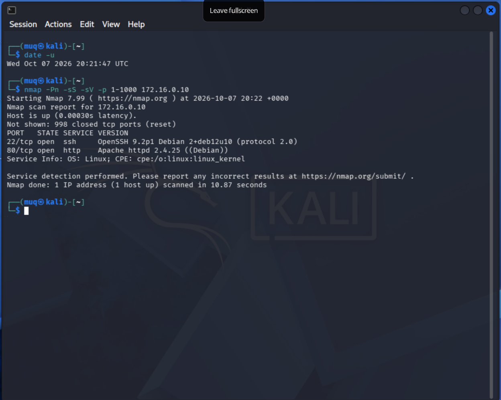
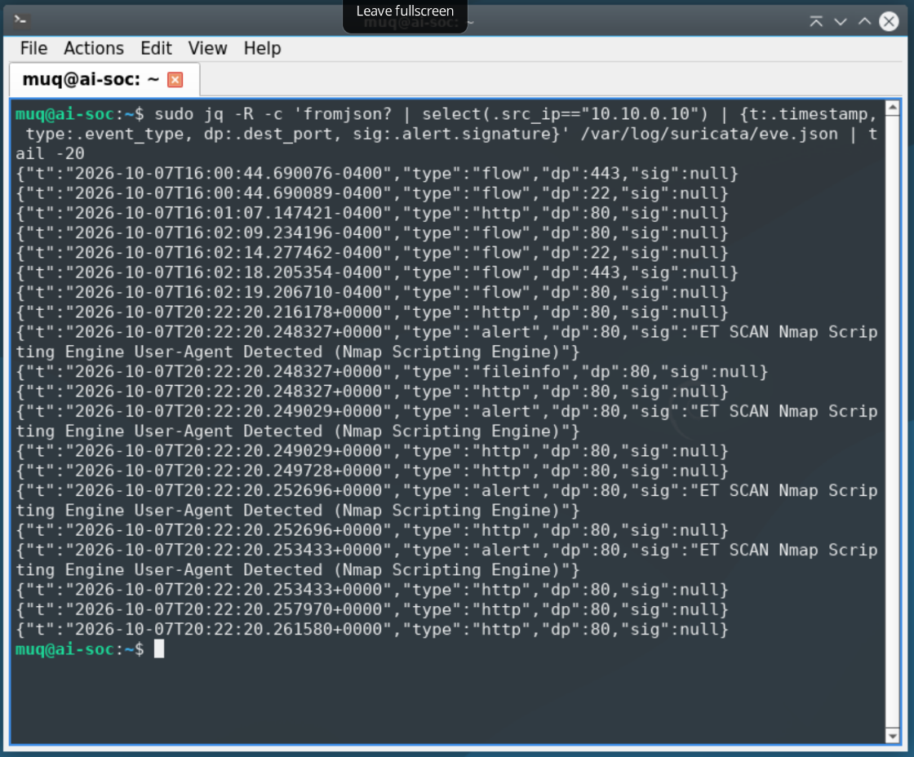
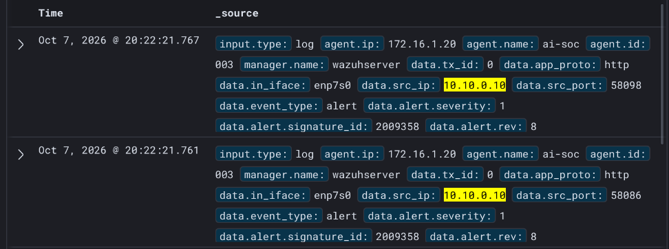
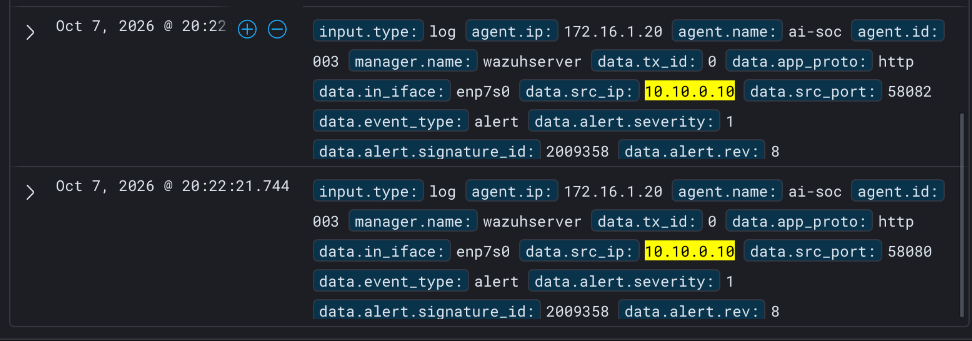
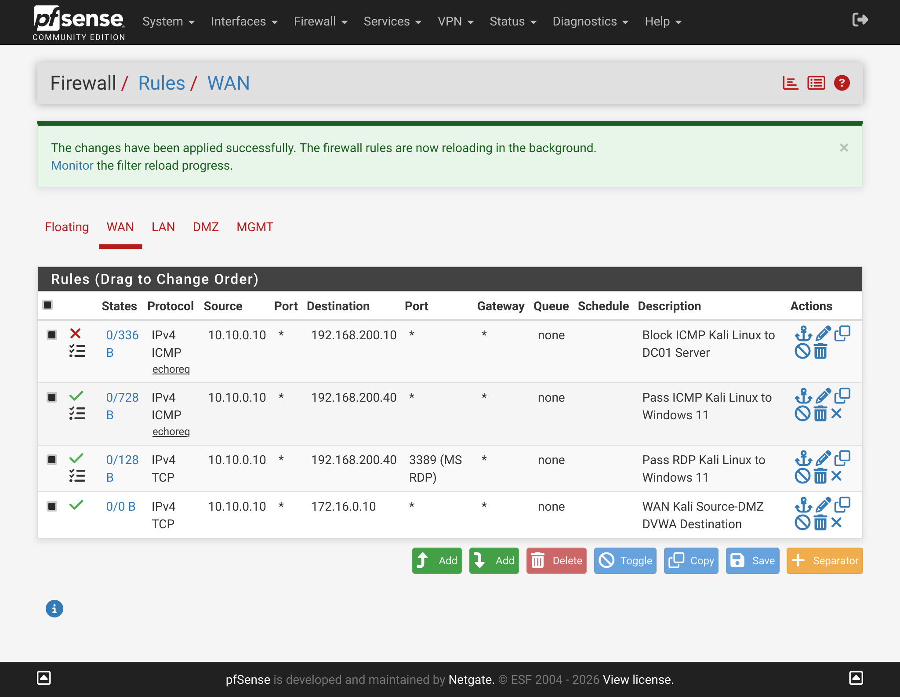

[<- GO BACK TO PENTESTING (REGRESAR)](https://github.com/MarvinUQ/Projects/blob/main/Pentesting/README.md)

# Nmap Recon Test: Detection Across pfSense, Suricata and Wazuh

Oct 7, 2026 · @Marvin

2026-10-07, a Kali host on the WAN scanned a DMZ host through pfSense. A plain SYN scan left only flow records, while a service-version scan (`-sV`) raised four Suricata alerts, so the sensor detects this tool by its fingerprint but not by its scanning behavior.

## Journal header

| Field | Entry |
| --- | --- |
| Date | 2026-10-07 |
| Entry | PTest-E001 |
| Description | Controlled reconnaissance test: Kali scans the DMZ Debian host through pfSense, and the Suricata sensor and Wazuh are checked for detection. |
| Tool(s) used | nmap 7.99, curl, tcpdump, jq, Suricata 7.0.10 (Emerging Threats Open rules), Wazuh, pfSense firewall log |
| Who | Kali host 10.10.0.10 (WAN), operated by Marvin |
| What | An nmap SYN scan, then an nmap SYN scan with service-version detection (`-sV`) |
| When | 2026-10-07, about 20:01 to 20:22 UTC |
| Where | WAN to DMZ Debian 172.16.0.10, crossing pfSense; observed on the sensor's capture NIC `enp7s0` |
| Why | Confirm the sensor detects real attacker traffic before adding AI triage on top of it |
| Additional notes | The DMZ host runs DVWA and is intentionally vulnerable. The test had no impact outside the lab. |

## Executive summary

- **Overview:** Kali ran two scans against the DMZ Debian at 172.16.0.10. The traffic crossed pfSense, was copied from the DMZ port to the sensor's capture NIC, and was analyzed by Suricata.
- **Impact:** None. The target is a lab host, and nothing left the lab.
- **Result:** The `-sV` scan raised four alerts named **ET SCAN Nmap Scripting Engine User-Agent Detected** at 20:22:20 UTC. The SYN scans, including a 1,000-port sweep, raised no scan alert.
- **Recommendation summary:** Add behavior-based scan detection, reduce what the WAN rule exposes, log the WAN pass rule, and tune the noisy informational rule.

## Attack, defender signal and mitigation control

### Attack

Kali (10.10.0.10) sent TCP probes to 172.16.0.10 through pfSense, which passes traffic from that one source to that one destination. Ports 22 (OpenSSH 9.2p1) and 80 (Apache httpd 2.4.25) were open, and 443 was closed. MITRE ATT&CK technique: T1046, Network Service Discovery.

```bash
nmap -Pn -sS -p 22,80,443 172.16.0.10
nmap -Pn -sS -sV -p 1-1000 172.16.0.10
```

The second scan took 10.87 seconds and reported 998 closed ports (reset).

### Defender signal

- **Suricata:** four alerts with the signature ET SCAN Nmap Scripting Engine User-Agent Detected, destination port 80, source 10.10.0.10, between 20:22:20.248 and 20:22:20.253 UTC. They came from the HTTP requests that `-sV` sends to identify the web server.
- **No alert:** the SYN-only scans left `flow` records but no scan alert.
- **pfSense:** earlier ICMP from Kali was dropped on WAN by the default deny rule, which showed that the first WAN rule matched TCP only.
- **Wazuh:** the same four alerts reached the dashboard at 20:22:21 UTC from agent ai-soc (ID 003). Each shows data.in_iface: enp7s0, data.src_ip: 10.10.0.10, signature ID 2009358, severity 1 and data.app_proto: http, with source ports 58080, 58082, 58086 and 58098. That confirms the alerts came from the mirrored DMZ traffic and that the path from sensor to Wazuh works end to end.

To read what Suricata recorded for the attacker:

```bash
sudo grep '"src_ip":"10.10.0.10"' /var/log/suricata/eve.json | jq -c '{t:.timestamp, type:.event_type, dp:.dest_port, sig:.alert.signature}' | tail -20
```

### Mitigation control

The signature catches a tool's fingerprint, so a scan that avoids service detection passes with flow records only. Closing that gap needs behavior-based detection (many connections from one source in a short time) and a smaller exposed surface. The remediation plan below lists the actions.

## Timeline (UTC)

| Time (UTC) | Phase | Event |
| --- | --- | --- |
| 19:33:57 to 19:34:00 (pfSense clock) | Blocked | Kali pings to 172.16.0.10 dropped on WAN by the default deny rule. |
| about 20:01 | Reconnaissance | `curl` HEAD request and `nmap -Pn -sS -p 22,80,443`. The sensor captured the TCP handshake and the HTTP request on `enp7s0`. Only flow records were logged. |
| 20:21:47 | Reference | `date -u` on Kali matches the sensor's UTC clock. |
| 20:22:00 | Reconnaissance | `nmap -Pn -sS -sV -p 1-1000 172.16.0.10` starts and runs for 10.87 seconds. |
| 20:22:20 | Detection | Suricata raises four ET SCAN alerts for Nmap Scripting Engine User-Agent. |

## NIST CSF 2.0 view

| Function | Application in this test |
| --- | --- |
| Identify | Assets: Kali (attacker), DMZ host 172.16.0.10, pfSense, the sensor and the Wazuh server. Zones: WAN, LAN, DMZ and MGMT. |
| Protect | Zone segmentation, a WAN rule limited to one source and one destination, and least-privilege MGMT rules for the sensor. |
| Detect | The DMZ port is mirrored to `enp7s0`, Suricata applies Emerging Threats signatures, and the Wazuh agent forwards `eve.json`. |
| Respond | Not exercised. Suricata runs in IDS mode (`action: allowed`) and no playbook was run. The response here was analysis and tuning. |
| Recover | Not applicable. The test had no impact on the target. |

## Technical analysis

- **What matched:** the user-agent string that nmap's scripting engine sends in HTTP requests.
- **What did not match:** SYN probes alone, even across 1,000 ports. The Emerging Threats rules in use looked at application content, not at connection volume.
- **Blind spots:** the mirror only carries traffic that pfSense lets through. Kali's pings never reached the DMZ because the WAN rule was TCP only. LAN traffic is not mirrored yet.
- **Evidence quality:** Kali's `date -u` and the sensor's UTC timestamps agree, so events from the two systems can be lined up.

## Remediation plan

| Priority | Category | Corrective action | Responsible party | Target date |
| --- | --- | --- | --- | --- |
| High | Detection | Add behavior-based scan detection: a threshold rule or Wazuh correlation on many connections from one source in a short time. | Marvin | 7 days |
| High | Network | Limit the WAN rule to the web port, and keep SSH on the DMZ host reachable from MGMT only. | Marvin | 7 days |
| Medium | Logging | Turn on logging for the WAN pass rule so passed scan traffic appears in the firewall log. | Marvin | 7 days |
| Medium | Tuning | Suppress or downgrade SID 2013504 (APT User-Agent) so scan alerts stand out. | Marvin | 14 days |
| Medium | Testing | Compare `-sS`, `-sS -sV` and `-A` scans and record which ones raise alerts. | Marvin | 14 days |
| Low | Coverage | Extend the mirror to the LAN port and repeat the tests against LAN hosts. | Marvin | 30 days |

## Framework mapping

| Framework | Reference | Relevance |
| --- | --- | --- |
| MITRE ATT&CK | T1046 Network Service Discovery; T1595 Active Scanning | The technique tested. |
| NIST CSF 2.0 | DE.CM-01, DE.AE-02 | Networks are monitored and potentially adverse events are analyzed. |
| CIS Controls v8.1 | 13.3 Deploy a Network Intrusion Detection Solution; 8.2 Collect Audit Logs | The sensor is the IDS, and Wazuh collects its logs. |
| NIST SP 800-53 Rev. 5 | SI-4 System Monitoring; SC-7 Boundary Protection; AU-6 Audit Record Review | Monitoring, boundary rules and log review. |
| ISO/IEC 27001:2022 | A.8.16 Monitoring activities; A.8.22 Segregation of networks | Monitoring and zone separation. |

## Evidence

- [ ] Kali terminal: `date -u` and the `nmap -sV` command with its output



- [ ] Sensor: the `eve.json` alert lines, and confirmation that `in_iface` shows `enp7s0`



- [ ] Wazuh dashboard: the four alerts with `data.src_ip`, `data.dest_ip` and `data.alert.signature`





- [ ] pfSense firewall log: the default deny for ICMP, and the pass rule once logging is on



- [ ] A short table comparing the three scan types


## Spanish summary

# Prueba de Reconocimiento con Nmap: Detección mediante pfSense, Suricata y Wazuh.

- 2026-10-07, escaneo a Debian en subred DMZ con Kali Linux en subred WAN a travez de pfSense, un escaneo simple SYN mostró solo records de flujo, mientras el escaneo de versión de servicio ("-sV") generó cuatro alertas en Suricata, por lo que el sensor detecta la herramienta por su huella digital y no por su comportamiento de escaneo.

## Cabezera de Diario.
 
| Campo | Entrada |
| --- | --- |
| Entrada | PTest-E001 |
| Descripción | Prueba de reconocimiento controlada: Kali en WAN escanea a Debian en DMZ a travez de pfSense, y los registros de detección en el sensor Suricata y Wazuh son verificados. |
| Herramientas utilizadas | nmap 7.99, curl, tcpdump, jq, Suricata 7.0.10 (Emerging Threats Open rules), Wazuh, pfSense firewall log. |
| Quien? | Anfitrión Kali 10.10.0.10 (WAN), operado por Marvin |
| Qué? | Escaneo SYN de nmap, luego un escaneo de nmap con detección de versión de servicios ("-sV"). |
| Cuando? |  2026-10-07 alrededor de las 20:01 to 20:22 UTC |
| Dónde? | WAN to DMZ Debian 172.16.0.10, cruzando pfSense; observado en la tarjeta de red con proposito de captura `enp7s0` |
| Por qué? | Confirmar la capacidad del sensor para detectar ataques antes de agregar Agentes de inteligencia artificial para Triage. |
| Notas adicionales: | DMZ Debian corre DVWA y es intencionalmente vulnerable. Esta prueba no efecto fuera del laboratorio. |

## Sumario Ejecutívo

- **Visión general** Kali hizo dos escaneos a DMZ Debian en 172.16.0.10. El tráfico cruzó pfSense, fue copiado del puerto de DMZ a la tarjeta de captura del sensor y fue analizado por Suricata.
- **Impacto** Ningúno, el objetívo es un anfitrión del laboratorio, por lo que nada sale de él.
- **Resultado** El escaneo "-sV" produjo cuatro alertas llamadas **ET SCAN Nmap Scripting Engine User-Agent Detected** a las 20:22:20 UTC. El escaneo SYN, incluido un barrido de 1000 puertos no produjo alertas.
- **Sumario de recomendación** Agregar detección de escaneo basada en comportamiento, reducir la exposición de la regla en WAN, registrar la regla en WAN y mejorar la regla de ruido informacional.

## Ataque, Señal de Defensa y Control de Mitigación.
 
### Ataque
  
 Kali (10.10.0.10) envia sondas TCP a 172.16.0.10 a travez de pfSense, el cual pasa tráfico desde esa fuente hacia ese destino. Puertos 22 (OpenSSH 9.2p1) y 80 (Apache httpd 2.4.25) se encontraban abiertos y el 443 estaba cerrado. *MITRE ATT&CK technique: T1046, Network Service Discovery.

```bash
nmap -Pn -sS -p 22,80,443 172.16.0.10
nmap -Pn -sS -sV -p 1-1000 172.16.0.10
```
 
El segundo escaneo tomó 10.87 segundos y reportó 998 puertos cerrados (reseteó).
 
### Señal de Defensa

- **Suricata:** Cuatro alertas con la firma ET SCAN Nmap Scripting Engine User-Agent Detected puerto de destino 80, fuente 10.10.0.10, entre las 20:22:20.248 y las 20:22:20.253 UTC. Estas provienen de las solicitudes por HTTP que "-sV" hace para identificar el servidor web.

- **Sin alerta:** El escaneo solo-SYN no produjo alertas, solo dejo el registro del flujo.

- **pfSense:** Los primeros intentos de ping (ICMP) desde Kali WAN fueron desechados por la regla de rechazo predeterminado, lo que mostró que la regla existente en WAN solo comtemplaba el protocolo TCP.

- **Wazuh:** Las mismas cuatro alertas se muestran en el dashboard a las 20:22:21 UTC provenientes del agente ai-soc (ID 003) cada una muestra data.in_iface: enp7s0, data.src_ip: 10.10.0.10, signature ID 2009358, severity 1 y data.app_proto: http, con puertos fuente 58080, 58082, 58086 y 58098. Esto confirma que las alertas provienen del trafico espejo de DMZ y que el camino desde el sensor Surica a Wazuh funciona de punto a punto.

Para leer lo que Suricata registró para el atacante:

```bash
sudo grep '"src_ip":"10.10.0.10"' /var/log/suricata/eve.json | jq -c '{t:.timestamp, type:.event_type, dp:.dest_port, sig:.alert.signature}' | tail -20
```

### Control de mitigación

La firma detecta la huella digital de una herramienta, por lo que un escaneo que evite la detección de servicios pasará únicamente con registros de flujo (flow records). Cerrar esa brecha requiere detección basada en comportamiento (muchas conexiones desde un mismo origen en poco tiempo) y una superficie de exposición más pequeña. El plan de remediación a continuación enumera las acciones.

## Plan de remedio

| Prioridad | Categoría | Accioón correctiva | Responsables | Fecha objetivo |
| --- | --- | --- | --- | --- |
| Alto | Detección | Agregar detección de escaneo: Una regla de máximo tráfico de paquetes o correlación en Wazuh de muchas conexiones desde una sola fuente en un corto periodo. | Marvin | 7 días |
| Alto | Red | Limitar la regla en WAN al puerto web, and dejar SSH en DMZ Debian accesible unicamente desde MGMT | Marvin | 7 días |
| Medio | Registro | Activar el registro del tráfico en la regla de paso permitido en WAN para que el tráfico sea escaneado y aparezca en el registro del firewall | Marvin | 7 días |
| Medio | Mejora | Suprimir o disminuir SID 2013504 (APT User-Agent) para resaltar las alertas de escaneo | Marvin | 14 días |
| Medio | Prueba | Comparar los escaneos "-sS", "-sS -sV" y "-A" y registrar cuales alertas producen. | Marvin | 14 días |
| Bajo | Covertura | Extender el espejo hacia el puerto LAN y repetir las pruebas en los anfitriones en LAN | Marvin | 30 días |

## Cronología (UTC)

| Hora (UTC) | Fase | Evento |
| --- | --- | --- |
| 19:33:57 a 19:34:00 (reloj de pfSense) | Bloqueado | Los pings de Kali hacia 172.16.0.10 fueron descartados en la WAN por la regla de denegación por defecto. |
| aprox. 20:01 | Reconocimiento | Solicitud `curl` HEAD y `nmap -Pn -sS -p 22,80,443`. El sensor capturó el saludo TCP (handshake) y la solicitud HTTP en `enp7s0`. Solo se registraron registros de flujo (flow records). |
| 20:21:47 | Referencia | `date -u` en Kali coincide con el reloj UTC del sensor. |
| 20:22:00 | Reconocimiento | Inicia `nmap -Pn -sS -sV -p 1-1000 172.16.0.10` y se ejecuta durante 10.87 segundos. |
| 20:22:20 | Detección | Suricata genera cuatro alertas ET SCAN para el User-Agent de Nmap Scripting Engine. |

## Perspectiva de NIST CSF 2.0

| Función | Aplicación en esta prueba |
| --- | --- |
| Identificar (Identify) | Activos: Kali (atacante), host de la DMZ 172.16.0.10, pfSense, el sensor y el servidor Wazuh. Zonas: WAN, LAN, DMZ y MGMT (Gestión). |
| Proteger (Protect) | Segmentación de zonas, una regla WAN limitada a un solo origen y un solo destino, y reglas de MGMT de mínimo privilegio para el sensor. |
| Detectar (Detect) | El puerto de la DMZ está replicado (mirrored) hacia `enp7s0`, Suricata aplica firmas de Emerging Threats y el agente de Wazuh reenvía el archivo `eve.json`. |
| Responder (Respond) | No se ejerció. Suricata se ejecuta en modo IDS (`action: allowed`) y no se ejecutó ningún libro de jugadas (playbook). La respuesta aquí fue de análisis y ajuste (tuning). |
| Recuperar (Recover) | No aplica. La prueba no tuvo impacto en el objetivo. |

## Análisis técnico

- **Lo que coincidió:** La cadena user-agent que el motor de scripting de nmap envía en las solicitudes HTTP.
- **Lo que no coincidió:** Sondas SYN por sí solas, incluso a través de 1,000 puertos. Las reglas en uso de Emerging Threats analizaban el contenido de la aplicación, no el volumen de conexiones.
- **Puntos ciegos:** El puerto espejo (mirror) solo transporta el tráfico que pfSense permite pasar. Los pings de Kali nunca llegaron a la DMZ porque la regla WAN era exclusivamente TCP. El tráfico de la LAN aún no está replicado.
- **Calidad de la evidencia:** El comando `date -u` de Kali y las marcas de tiempo UTC del sensor coinciden, por lo que los eventos de ambos sistemas se pueden alinear cronológicamente.

## Plan de remediación

| Prioridad | Categoría | Acción correctiva | Responsable | Fecha límite |
| --- | --- | --- | --- | --- |
| Alta | Detección | Añadir detección de escaneos basada en comportamiento: una regla de umbral (threshold rule) o correlación en Wazuh ante múltiples conexiones desde un mismo origen en poco tiempo. | Marvin | 7 días |
| Alta | Red | Limitar la regla WAN únicamente al puerto web, y mantener el SSH del host de la DMZ accesible solo desde MGMT. | Marvin | 7 días |
| Media | Registros (Logging) | Activar el registro para la regla de paso (pass rule) de la WAN para que el tráfico de escaneo permitido aparezca en el log del firewall. | Marvin | 7 días |
| Media | Ajuste (Tuning) | Silenciar o degradar el SID 2013504 (APT User-Agent) para que las alertas de escaneo resalten más. | Marvin | 14 días |
| Media | Pruebas | Comparar los escaneos `-sS`, `-sS -sV` y `-A`, y registrar cuáles generan alertas. | Marvin | 14 días |
| Baja | Cobertura | Extender el puerto espejo (mirror) al puerto LAN y repetir las pruebas contra los hosts de la LAN. | Marvin | 30 días |

## Mapeo de marcos de referencia (Frameworks)

| Marco de referencia | Referencia | Relevancia |
| --- | --- | --- |
| MITRE ATT&CK | T1046 Network Service Discovery; T1595 Active Scanning | La técnica que fue probada. |
| NIST CSF 2.0 | DE.CM-01, DE.AE-02 | Se monitorean las redes y se analizan los eventos potencialmente adversos. |
| CIS Controls v8.1 | 13.3 Deploy a Network Intrusion Detection Solution; 8.2 Collect Audit Logs | El sensor actúa como el IDS y Wazuh recolecta sus registros (logs). |
| NIST SP 800-53 Rev. 5 | SI-4 System Monitoring; SC-7 Boundary Protection; AU-6 Audit Record Review | Monitoreo, reglas perimetrales y revisión de registros. |
| ISO/IEC 27001:2022 | A.8.16 Monitoring activities; A.8.22 Segregation of networks | Actividades de monitoreo y separación de redes. |
