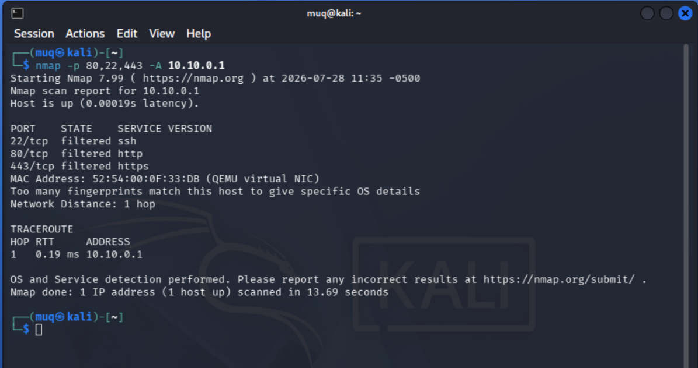

### Entry 001: Baseline Perimeter & Segmentation Verification (Nmap Recon)
**Objective: (Objetivo:)**
Verify that default firewall policies enforce both boundary isolation (WAN to LAN) and 
gateway self-protection before opening specific attack paths.

(Verificar que las políticas predeterminadas del firewall aseguran ambos, el aislamiento 
(WAN a LAN) y la protección de la puerta de acceso antes de iniciar la ruta de ataque.)

#### Test 1.1: Gateway Management Surface Exposure



**Target: (Objetivo:)** `10.10.0.1` (pfSense WAN Interface)
**Command (Comando:)** `nmap -p 80,22,443 -A 10.10.0.1`
**Result: (Resultado:)** All administrative ports (`22/ssh`, `80/http`, `443/https`) 
returned as **`filtered`**.
(Todos los puertos administrativos (`22/ssh`, `80/http`, `443/https`) respondieron 
**`filtered`**.)

**Finding: (Hallazgo:)** The pfSense WAN interface drops management traffic 
originating from the untrusted WAN segment, preventing unauthorized firewall 
administration attempts.

(La interfaz WAN de pfSense descarta el tráfico de administración proveniente 
del segmento WAN no confiable, previniendo intentos no autorizados de 
administración del firewall.)

#### Test 1.2: Inter-Zone Traffic Permeability (WAN → LAN)


**Targets: (Objetivos:)** `192.168.200.10` (Windows Server 2025 DC), 
`192.168.200.40` (Windows 11)
**Command (Comando:)** `nmap -Pn -sS -p 80,445,3389 192.168.200.10 192.168.200.40`
**Result: (Resultado:)**

```text
PORT     STATE    SERVICE
80/tcp   filtered http
445/tcp  filtered microsoft-ds
3389/tcp filtered ms-wbt-server
```

**Finding: (Hallazgo:)** The scan confirms that without explicit firewall pass 
rules, and with RFC 1918 blocking enabled on the WAN interface, cross-zone 
routing is completely inhibited. Packets are dropped silently (no TCP RST or 
ICMP unreachable messages returned), leaving the attacker with no visibility 
into internal target availability.

(El escaneo confirma que, sin reglas explícitas de paso en el firewall y con 
el bloqueo de RFC 1918 habilitado en la interfaz WAN, el enrutamiento entre 
zonas queda completamente inhibido. Los paquetes se descartan de forma 
silenciosa (sin RST de TCP ni mensajes ICMP de inalcanzable), sin dar al 
atacante ninguna visibilidad sobre la disponibilidad de los objetivos internos.)

**Defender Signal:**
pfSense Status → System Logs → Firewall — both tests logged automatically under 
**Default deny rule IPv4 (1000000103)** on the WAN interface. No Windows-side 
telemetry generated (Sysmon/Security logs), since no traffic reached Win11Lab 
or DC01 — the boundary held before packets ever arrived at the endpoints.

(pfSense Status → System Logs → Firewall — ambas pruebas quedaron registradas 
automáticamente bajo la **Default deny rule IPv4 (1000000103)** en la interfaz 
WAN. No se generó telemetría del lado de Windows (Sysmon/Security), ya que 
ningún tráfico llegó a Win11Lab ni a DC01 — el perímetro contuvo el tráfico 
antes de que los paquetes alcanzaran los endpoints.)

**Mitigation Control:** Default-deny + RFC 1918 blocking on WAN provide layered 
protection — verified working as intended prior to any scoped rule changes. 
Worth noting for later reference: pfSense logs default-deny hits automatically, 
but *pass* rules do not log unless explicitly configured (confirmed the hard 
way in Phase 2) — a detail worth building into any future rule-change checklist.

(Default-deny + bloqueo de RFC 1918 en WAN ofrecen protección por capas — 
verificado como funcionando correctamente antes de cualquier cambio de reglas. 
Vale la pena señalar para referencia futura: pfSense registra automáticamente 
los bloqueos por default-deny, pero las reglas de *paso* no se registran a 
menos que se configure explícitamente (confirmado de la forma difícil en la 
Fase 2) — un detalle que conviene incorporar en cualquier checklist futuro de 
cambios de reglas.)

---

### Entry 002: Scoped Rule Verification — Post-Phase 2 Port Discovery (T1046)
**Objective: (Objetivo:)**
Confirm that the Phase 2 firewall rule change exposes exactly the intended
surface (RDP, 192.168.200.40:3389) and nothing else, before proceeding to a
credential attack against that service.

(Confirmar que el cambio de regla del Phase 2 expone exactamente la superficie
prevista (RDP, 192.168.200.40:3389) y nada más, antes de proceder con un
ataque de credenciales contra ese servicio.)

#### Test 2.1: Full Candidate Port Sweep
**Command (Comando:)**
```bash
sudo nmap -sS --reason --open -p 21,22,80,135,139,443,445,3389,5985 -oN winlab_scan.txt 192.168.200.40
```
**Result: (Resultado:)** Host up via ICMP echo-reply (ttl 127). Of 9 candidate
ports, only `3389/tcp` responds open (`syn-ack`, ttl 127); the remaining 8
(SSH, HTTP/S, SMB, NetBIOS, WinRM) return no response and are marked filtered.

(Host activo vía echo-reply ICMP (ttl 127). De 9 puertos candidatos, solo
`3389/tcp` responde abierto (`syn-ack`, ttl 127); los 8 restantes no responden
y quedan marcados como filtrados.)

**Finding: (Hallazgo:)** The scoped rule behaves as intended — RDP is the
*only* administrative surface reachable from WAN; nothing else was
accidentally widened. This scan also confirms, from a second independent
angle, that the WAN→LAN ICMP rule (deliberately implemented and fixed on
2026-08-04 — [see Bugs-Conflicts-Fixing.md](https://github.com/MarvinUQ/Home-Lab/blob/main/Bugs-Conflicts-Fixing.md#wan---lan-icmp-connectivity-troubleshooting-soluci%C3%B3n-de-problemas-de-conectividad-icmp-wan---lan))
for troubleshooting purposes is still functioning correctly: the host
discovery probe (unlike Entry 001, which used `-Pn` and skipped it entirely)
received a clean echo-reply.

(La regla se comporta según lo previsto — RDP es la *única* superficie
administrativa alcanzable desde WAN; nada más quedó abierto por accidente.
Este escaneo también confirma, desde un ángulo independiente, que la regla
ICMP WAN→LAN — implementada deliberadamente para solución de problemas y
corregida el 2026-08-04 — sigue funcionando correctamente: la sonda de
descubrimiento de host recibió un echo-reply limpio.)

**Side-observation resolved (2026-08-13):** During Defender Signal
verification, the WAN firewall log showed a paired ICMP entry for this same
host-discovery probe — one `Pass ICMP Kali Linux to Windows 11`, one
`Default deny`, same second. Inspecting rule `1785878593` directly showed
its ICMP Subtypes field scoped to `Echo request` only, not `any`. Nmap's
host discovery sends both an Echo Request and a Timestamp Request in
parallel; the former matches the pass rule and logs under its name, the
latter falls outside its scope and falls through to default-deny. Confirmed
by inspection, not inferred.

(Observación lateral resuelta (2026-08-13): durante la verificación de la
Señal del Defensor, el registro WAN mostró una entrada ICMP pareada para
esta misma sonda de descubrimiento — una `Pass ICMP...`, una `Default
deny`, mismo segundo. Al inspeccionar la regla 1785878593 se confirmó que
su campo de Subtipos ICMP está limitado a `Echo request`, no a `any`. Nmap
envía tanto un Echo Request como un Timestamp Request en paralelo; el
primero coincide con la regla de paso, el segundo cae al default-deny.
Confirmado por inspección directa.)

#### Test 2.2: Packet-Level Confirmation
**Command (Comando:)**
```bash
sudo nmap -sS --open --packet-trace -p 135,445,3389,5985 192.168.200.40
```
**Result: (Resultado:)** Cross-validates Test 2.1 on a smaller port set —
SYN to `3389` returns `SA` (ttl 127, win 64000); `135/445/5985` remain silent.

(Confirma el Test 2.1 en un subconjunto de puertos — el SYN a `3389` recibe
`SA` (ttl 127, win 64000); `135/445/5985` no responden.)

**Unplanned finding: (Hallazgo no planeado:)** This run omitted the standing
`-n` flag. The trace captures Nmap's reverse-DNS PTR lookup stalling for
~4.5 seconds — three retried UDP/53 queries to `1.1.1.1`, zero replies —
before Nmap gives up and proceeds. Live, second confirmation of the
already-documented root cause (pfSense WAN default-deny silently drops
outbound UDP/53), and a reminder of why `-n` stays a standing flag.

(Esta ejecución omitió la bandera estándar `-n`. La traza captura la
resolución PTR inversa de Nmap bloqueada por ~4.5 segundos — tres reintentos
UDP/53 hacia `1.1.1.1` sin respuesta — antes de continuar. Segunda
confirmación en vivo de la causa raíz ya documentada.)

**Defender Signal (confirmed 2026-08-13):**
Live pfSense WAN log, pulled immediately after re-running Test 2.1. The 8
filtered candidate ports (21, 22, 80, 135, 139, 443, 445, 5985) generated
`Default deny rule IPv4 (1000000103)` entries across two probe waves,
matching Nmap's own retry behavior for non-responding ports. Port 3389 —
the one open, explicitly-permitted port — also generated a log line
(`USER_RULE (1785294592)`), appearing only once, in the wave that received
a response.

This overturns the original hypothesis rather than confirming it: the pass
rule's logging was assumed to be off; it's actually on. The real asymmetry
isn't logged-vs-silent, it's named-vs-anonymous. Rules with a filled
Description field (the ICMP pass/block pair built earlier) log under a
readable name; this RDP pass rule, having no Description set, logged only
as an opaque tracking ID — same evidentiary footprint, meaningfully higher
triage cost for an analyst scanning the log live.

(Señal del defensor, confirmada el 2026-08-13: registro real de pfSense
(WAN), extraído inmediatamente después de repetir el Test 2.1. Los 8
puertos filtrados generaron entradas de `Default deny rule IPv4
(1000000103)`. El puerto 3389 — el único puerto abierto y explícitamente
permitido — también generó una línea de registro (`USER_RULE
(1785294592)`). Esto revierte la hipótesis original: el registro de la
regla de paso sí está activo; la asimetría real no es
registrado-vs-silencioso, sino nombrado-vs-anónimo, según si la regla tiene
un campo de Descripción completado.)

**Verification (2026-08-13, second pass):** After adding a Description to
the RDP pass rule (Mitigation Control #1), Test 2.1 was re-run unchanged.
Same tracking ID (1785294592), same wave pattern — only the log's rule
label changed, from an anonymous `USER_RULE` to `Pass RDP Kali Linux to
Windows 11`. Confirms the fix addresses exactly what it was meant to and
nothing else shifted.

(Verificación (2026-08-13, segunda pasada): tras agregar una Descripción a
la regla de paso RDP, se repitió el Test 2.1 sin cambios. Mismo Tracking ID
— solo cambió la etiqueta de la regla en el registro, de un `USER_RULE`
anónimo a `Pass RDP Kali Linux to Windows 11`. Confirma que la corrección
resuelve exactamente lo previsto.)

**Mitigation Control:**
1. Add a Description to every pass/block rule, not only the ones built for
   this documentation exercise. Logging being enabled isn't sufficient on
   its own — an anonymous `USER_RULE` entry is a real triage blind spot for
   an analyst scanning the log live, even when the packet is technically
   captured.
2. `-n` isn't just a speed flag — every run without it silently re-probes
   the WAN UDP/53 default-deny and adds a reproducible ~4.5s stall.
3. Log retention has a shelf life. Pull confirming evidence the same
   session as the test — waiting even a week risks losing it to rotation
   entirely.
4. Confirm hypotheses against real logs before writing them into the
   record. The original prediction here was wrong on both axes it could be
   wrong on — whether logging happened, and why. "Sounds plausible" isn't
   the same as verified, even when the underlying mental model of the
   firewall is basically correct.

(1. Agregar una Descripción a cada regla de paso/bloqueo — el logging
activado no es suficiente por sí solo; una entrada `USER_RULE` anónima
sigue siendo un punto ciego real de triage. 2. `-n` no es solo optimización
de velocidad — cada ejecución sin ella vuelve a probar el default-deny
UDP/53 del WAN. 3. Los registros tienen una vida útil limitada — extraer la
evidencia en la misma sesión de la prueba. 4. Confirmar las hipótesis
contra registros reales antes de escribirlas — la predicción original
estaba equivocada en ambos ejes posibles; "suena razonable" no equivale a
verificado.)

---

### Entry 003: Credential Brute-Force — Hydra vs. RDP (T1110.001)
**Objective: (Objetivo:)**
Attempt credential brute-force against the domain account `hydratest` via RDP 
(192.168.200.40:3389), exposed by the scoped Phase 2 firewall rule, and correlate 
the resulting telemetry across Windows Event Log, Wazuh, and packet capture.

(Intentar un ataque de fuerza bruta de credenciales contra la cuenta de dominio 
`hydratest` vía RDP (192.168.200.40:3389), expuesta por la regla de firewall del 
Phase 2, y correlacionar la telemetría resultante entre el log de Eventos de 
Windows, Wazuh, y captura de paquetes.)

#### Attempt 1: Unqualified Username — Conclusively Failed (Username Resolution)
**Command (Comando:)**
```bash
hydra -l hydratest -P rdp_wordlist.txt -t 1 -V -f rdp://192.168.200.40
```
**Result: (Resultado:)** 12 attempts, 0 valid passwords found — including the 
correct password (`YourStrongPassword123!`, attempt 6 of 12), which failed 
identically to every wrong guess.

(12 intentos, 0 contraseñas válidas encontradas — incluyendo la contraseña 
correcta (`YourStrongPassword123!`, intento 6 de 12), que falló de forma idéntica 
a cada intento incorrecto.)

**Finding: (Hallazgo:)** Conclusively a username-resolution failure, not a 
password failure. Event ID 4625 across all 12 attempts carries Sub Status 
`0xC0000064` (`STATUS_NO_SUCH_USER`) — Windows never reached password comparison. 
Since the real password was already in the wordlist and failed the same way as 
every wrong one, a credential issue is ruled out directly by the evidence, not by 
recollection. Root cause: an unqualified `-l hydratest` caused NTLM to resolve the 
username against Win11Lab's *local* SAM database rather than the domain (LAB), 
which has no matching local account.

(Concluyentemente un fallo de resolución de nombre de usuario, no de contraseña. 
El Event ID 4625 en los 12 intentos presenta Sub Status `0xC0000064` 
(`STATUS_NO_SUCH_USER`) — Windows nunca llegó a comparar la contraseña. Dado que 
la contraseña real ya estaba en la wordlist y falló igual que cada intento 
incorrecto, un problema de credencial queda descartado por la evidencia misma, no 
por recuerdo. Causa raíz: un `-l hydratest` sin calificar provocó que NTLM 
resolviera el usuario contra la base de datos SAM *local* de Win11Lab en lugar 
del dominio (LAB), que no tiene una cuenta local coincidente.)

#### Attempt 2: Domain-Qualified (`/LAB`) — Failed, Root Cause Open
**Command (Comando:)**
```bash
hydra -l hydratest -P rdp_wordlist.txt -t 1 -V -f rdp://192.168.200.40/LAB
```
**Result: (Resultado:)** Repeated ambiguous `account might be valid but account 
not active for remote desktop` messages against multiple confirmed-wrong 
passwords, at ~0.25 tries/min. Run abandoned in favor of packet-level 
verification.

(Mensajes ambiguos repetidos de `account might be valid but account not active 
for remote desktop` contra múltiples contraseñas confirmadamente incorrectas, a 
~0.25 intentos/min. Ejecución abandonada en favor de verificación a nivel de 
paquete.)

**Packet capture findings (pfSense, `vtnet0`):**
- TCP handshake and full TLS handshake (NLA layer) complete cleanly (~18ms) — 
  X.224 negotiation, ClientHello/ServerHello/Certificate, ClientKeyExchange, 
  both Finished messages all properly sized
- **Zero application-data packets in either direction for ~82 seconds 
  afterward** — 17 keep-alive ACK pairs at a steady ~5.12s interval, no payload
- Connection terminated by a **server-initiated RST** ~90s after the last real 
  data packet
- A parallel, unrelated finding investigated and ruled out: Kali's DNS traffic to 
  `1.1.1.1` (74 UDP:53 packets, all unanswered — consistent with the isolated WAN 
  zone) runs at a constant cadence from before the RDP connection opens through 
  well after it stalls, with zero correlation to the stall window
  
(Handshake TCP y TLS completo (capa NLA) sin problemas (~18ms). Cero paquetes de 
datos de aplicación en cualquier dirección durante ~82 segundos — 17 pares de 
ACK keep-alive a intervalo constante de ~5.12s, sin payload. Conexión terminada 
por un **RST iniciado por el servidor** ~90s después del último paquete de datos 
real. Hallazgo paralelo investigado y descartado: el tráfico DNS de Kali hacia 
`1.1.1.1` mantiene un ritmo constante sin correlación con la ventana de bloqueo.)

**Finding: (Hallazgo:)** The TLS tunnel for NLA is built successfully, but the 
CredSSP/NTLM credential exchange — which must travel as encrypted application 
data inside that tunnel — never occurs. A live TLS session with zero application 
payload for 82 seconds points to a client-side stall in Hydra's FreeRDP-based RDP 
module, consistent with the module's documented history of both false positives 
and false negatives in public bug reports. Whether the domain qualifier itself 
triggered this specific stall, versus the module's known non-determinism simply 
landing this way on this run, is not established (see Open Question below).

(El túnel TLS para NLA se construye con éxito, pero el intercambio de 
credenciales CredSSP/NTLM nunca ocurre. Una sesión TLS activa con cero payload de 
aplicación durante 82 segundos apunta a un bloqueo del lado del cliente en el 
módulo RDP de Hydra, basado en FreeRDP, consistente con el historial documentado 
de falsos positivos y falsos negativos del módulo. Si el calificador de dominio 
en sí provocó este bloqueo específico, o si la no determinismo conocida del 
módulo simplemente se manifestó así en esta ejecución, no está establecido.)

#### Attempt 3: Unqualified Retry — Success, Confirmed Two Ways
**Command (Comando:)**
```bash
hydra -l hydratest -p 'YourStrongPassword123!' -t 1 -V rdp://192.168.200.40
```
**Result: (Resultado:)**
```text
[3389][rdp] host: 192.168.200.40   login: hydratest   password: YourStrongPassword123!
1 of 1 target successfully completed, 1 valid password found
```
Completed in ~10 seconds.

**Packet capture findings:** full protocol negotiation completes in ~167ms — TLS 
handshake, then immediate continuation into CredSSP and further data consistent 
with MCS Connect/channel-join stage (payload sizes up to 555 bytes, well beyond 
a CredSSP-only exchange), ending in a **clean, client-initiated FIN** rather than 
a timeout or reset. A server only permits progression that far if the submitted 
credentials were accepted.

(Negociación completa del protocolo en ~167ms — handshake TLS, seguido de 
continuación inmediata hacia CredSSP y datos adicionales consistentes con la 
etapa de MCS Connect/unión de canales, terminando en un **FIN limpio iniciado 
por el cliente** en lugar de timeout o reset.)

**Finding: (Hallazgo:)** Two independent sources agree — Hydra's own terminal 
report and the packet-level protocol completion both confirm a genuine successful 
credential validation, not just a tool-reported claim.

(Dos fuentes independientes coinciden — el reporte del propio terminal de Hydra 
y la finalización del protocolo a nivel de paquete confirman una validación de 
credenciales genuinamente exitosa, no solo una afirmación reportada por la 
herramienta.)

**Open Question: (Pregunta abierta:)** Attempts 1 and 3 both used identical, 
unqualified syntax and produced opposite outcomes (clean username-resolution 
failure vs. clean success) — expected, since Attempt 1 targeted a nonexistent 
local-SAM lookup regardless of password. Attempt 2, the only domain-qualified 
run, is the one that stalled. This is suggestive but not conclusive: one trial 
per condition cannot distinguish "domain qualification causes instability" from 
"Hydra's RDP module is independently non-deterministic and happened to stall on 
this run." Flagged for controlled repeat testing (multiple trials per condition, 
all other variables held constant) rather than asserted as resolved.

(Los Intentos 1 y 3 usaron sintaxis idéntica sin calificar y produjeron 
resultados opuestos — esperado, ya que el Intento 1 apuntaba a una búsqueda 
inexistente en el SAM local independientemente de la contraseña. El Intento 2, 
la única ejecución calificada por dominio, es la que se bloqueó. Esto es 
sugestivo pero no concluyente — marcado para pruebas repetidas controladas en 
lugar de darse por resuelto.)

**Defender Signal:**
Correlated across four independent sources for the same event sequence — Windows 
Event Viewer (Security + Sysmon), Wazuh Discover, Wazuh rule detail pages, and 
packet capture:

- **Sysmon Event ID 1** — `winlogon.exe` process creation, `TerminalSessionId: 2`, 
  launched by SYSTEM. OS-level fingerprint of a new RDP session initializing.
- **Wazuh rule `60122`** ("Logon Failure - Unknown user or bad password", level 5) 
  ×4 — one per wrong-password attempt before the real one in Attempt 3's 
  wordlist-based predecessor run. Stock rule (`0580-win-security_rules.xml`), 
  matches Event ID `4625` (and legacy `529`). Mapped to PCI DSS 10.2.4/10.2.5, 
  GDPR IV_35.7.d/IV_32.2, HIPAA 164.312.b, NIST 800-53 AU.14/AC.7.
- **Wazuh rule `60204`** ("Multiple Windows Logon Failures", **level 10**) — a 
  correlation rule, not a single-event match: fires on a cluster of `60122` 
  failures in a short window. This is the actual brute-force indicator — 
  individual failures are low-severity noise; the pattern is what escalates.
- **Wazuh rule `92657`** ("Successful Remote Logon Detected — NTLM 
  authentication, possible pass-the-hash", level 6) — fires on the successful 
  logon (`0840-win_event_channel.xml`). Mapped to MITRE **T1550.002 (Pass the 
  Hash), T1021.001 (RDP), T1078.002 (Domain Accounts)**, spanning Lateral 
  Movement, Defense Evasion, Persistence, Privilege Escalation, and Initial 
  Access tactics.
- **Windows User Logoff** immediately following the success event.
- **Packet capture** — network-layer corroboration independent of both Windows 
  telemetry and Hydra's self-reporting; confirmed the failure mode in Attempt 2 
  and cross-validated the success in Attempt 3.
(Correlacionado entre cuatro fuentes independientes: Visor de Eventos de 
Windows (Seguridad + Sysmon), Wazuh Discover, páginas de detalle de reglas de 
Wazuh, y captura de paquetes — ver detalle en inglés arriba para IDs de regla y 
mapeos MITRE/cumplimiento.)

**Mitigation Control:**
1. **Correlation over single events.** Rule `60204`'s level-10 escalation on a 
   *cluster* of `60122` failures is the actual actionable signal.
2. **Built-in compliance mapping validates manual framework work.** Wazuh's 
   stock rules ship pre-mapped to PCI DSS, GDPR, HIPAA, NIST 800-53, GPG13.
3. **Don't trust tool-generated labels at face value.** Rule `60122`'s MITRE 
   mapping ("Account Access Removal") is a poor fit for a failed logon attempt.
4. **Attacker tooling isn't ground truth — verify independently.** Hydra's RDP 
   module produced both an unreliable ambiguous signal (Attempt 2) and, 
   separately, a claim worth double-checking (Attempt 3) — packet capture 
   confirmed the latter and explained the former. Rule out confounds explicitly 
   rather than assume them (DNS traffic was checked and excluded, not just 
   dismissed).
5. **Clock synchronization gap identified.** Kali, Win11Lab, and Wazuh displayed 
   three different apparent time offsets for the same instant. Recommend NTP 
   configuration across all lab hosts.
6. **Tooling reliability is a testing consideration, not just a nuisance.** A 
   single ambiguous or failed run with security tooling (offensive or 
   defensive) shouldn't be taken as a definitive negative result — this 
   investigation needed three attempts and three data sources to reach a 
   confident conclusion.
(1. Correlación sobre eventos individuales. 2. El mapeo de cumplimiento integrado 
valida el trabajo manual. 3. No confiar en las etiquetas generadas por la 
herramienta sin verificar. 4. Las herramientas ofensivas no son verdad 
fundamental — verificar independientemente y descartar factores de confusión 
explícitamente. 5. Brecha de sincronización de reloj identificada — se 
recomienda NTP. 6. La fiabilidad de las herramientas es una consideración de 
prueba, no solo una molestia.)
